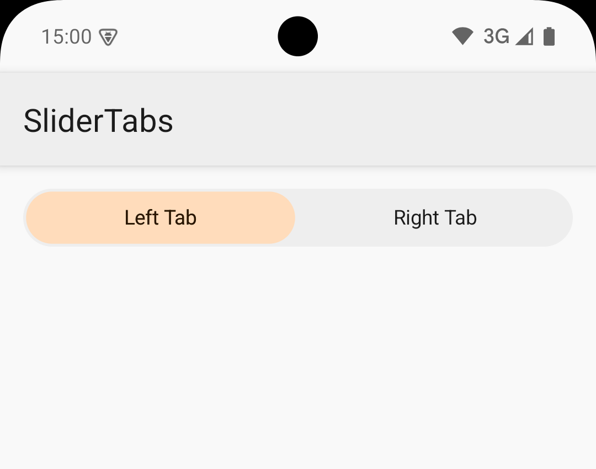
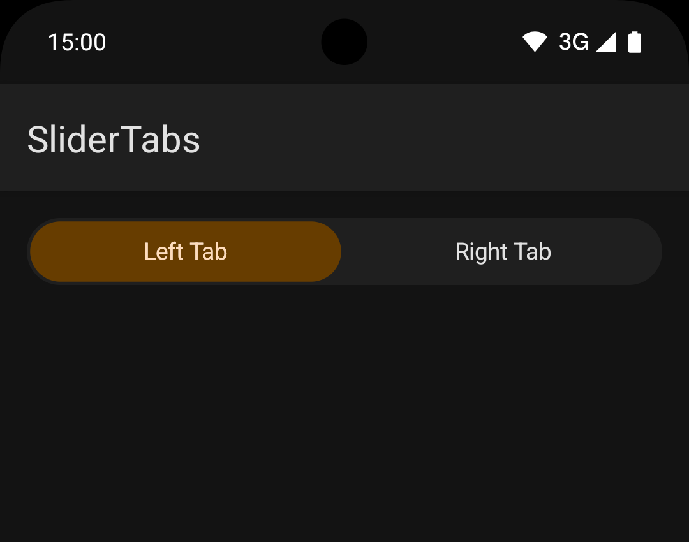

# SliderTabs

A SliderTabs is a two-state tab widget which allows a user to choose between two options.

## Appearance

SliderTabs support [Android Dynamic Colors](https://developer.android.com/develop/ui/views/theming/dynamic-colors) and
change the color themselves, depending on the user's settings.




## Installation

To add SliderTabs to your project, include the following repository in your `settings.gradle.kts`:

```kotlin
dependencyResolutionManagement {
    repositoriesMode.set(RepositoriesMode.FAIL_ON_PROJECT_REPOS)
    repositories {
        // Other repositories here.
        maven("https://nexus.vsulimov.com/repository/maven-releases/")
    }
}
```

Then, include the following dependency in your `build.gradle.kts`:

```kotlin
dependencies {
    implementation("com.vsulimov:slidertabs:1.0.0")
}
```

## Usage

### XML

Add the SliderTabs view to your layout XML file:

```xml
<com.vsulimov.slidertabs.SliderTabs 
    android:id="@+id/slider_tabs" 
    android:layout_width="match_parent"
    android:layout_height="40dp" 
    style="@style/SliderTabs" 
    app:st_leftTabText="Tab 1"
    app:st_rightTabText="Tab 2" />
```

## Customization

SliderTabs can be customized through XML attributes. Here are some of the available options:

- **`st_backgroundColor`**: Sets the background color of the view.
- **`st_backgroundColorPressed`**: Sets the background color when the view is pressed.
- **`st_sliderColor`**: Sets the color of the sliding indicator.
- **`st_onTabTextColor`**: Sets the color of the tab text.
- **`st_onSurfaceTextColor`**: Sets the color of the surface text.
- **`st_leftTabText`**: Sets the text for the left tab.
- **`st_rightTabText`**: Sets the text for the right tab.
- **`st_animationDuration`**: Sets the duration of the slider animation in milliseconds.

## Listening to Tab Selection Events

To receive callbacks when a tab is selected, implement the `OnTabSelectedListener` interface and set it on the
SliderTabs view:

```kotlin
sliderTabs.setOnTabSelectedListener(object : SliderTabs.OnTabSelectedListener {
    override fun onLeftTabSelected() {
        // Handle left tab selection
    }

    override fun onRightTabSelected() {
        // Handle right tab selection
    }
})
```

## State Persistence

SliderTabs automatically saves and restores its state across configuration changes, such as screen rotations. The
current tab selection is preserved, ensuring a seamless user experience.

## License

This library is licensed under the MIT License. See the [LICENSE](LICENSE) file for more details.
