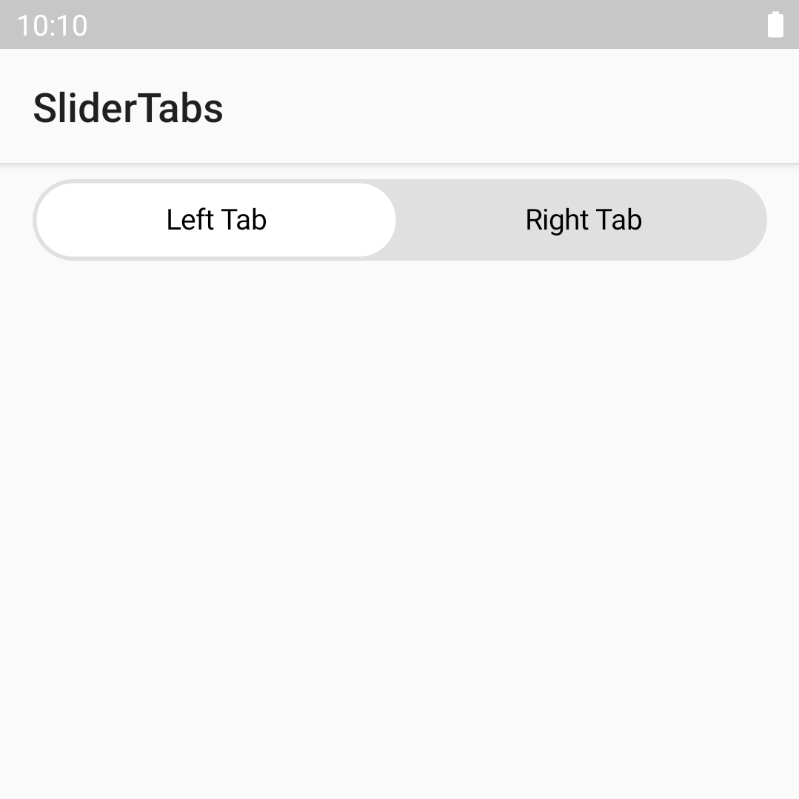
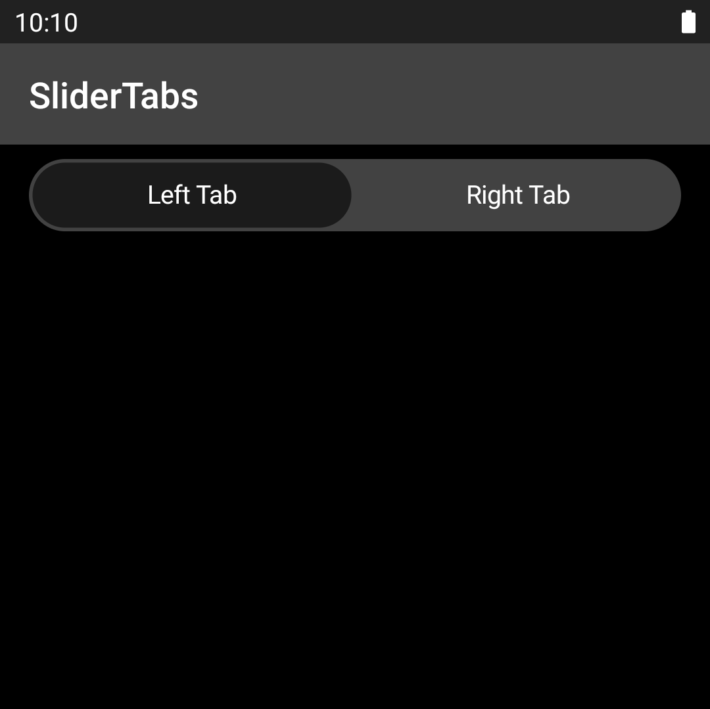

# SliderTabs (Kotlin)

A SliderTabs is a two-state tab widget which allows a user to choose between two options.
<br>
The user can click on the left / right sides to move the tab to the left or to the right respectively.


## This is how it looks like

<b>Light theme</b>



<b>Dark theme</b>




## Widget appearance configuration
You can configure widget appearance using default styles (<b>SliderTabs.DefaultLight</b> and <b>SliderTabs.DefaultDark</b>)
or through XML. There is a list of available attributes:

<pre>
<b>st_backgroundColor</b> - Background color in normal state

<b>st_backgroundColorPressed</b> - Background color in pressed state

<b>st_sliderColor</b> - Slider color

<b>st_tabTextColor</b> - Tab text color

<b>st_leftTabText</b> - Left tab text

<b>st_rightTabText</b> - Right tab text

<b>st_animationDuration</b> - Tab change animation duration in milliseconds
</pre>


## Public API
There is a several methods available for public usage
```kotlin
/**
 * Register a callback to be invoked when tab position changed.
 *
 * @param tabSelectedListener [OnTabSelectedListener] implementation
 */
fun setOnTabSelectedListener(tabSelectedListener: OnTabSelectedListener) {...}

/**
 * Force select left tab. This action will be performed without animation and
 * listener registered through [setOnTabSelectedListener]
 * will not be notified.
 */
fun selectLeftTab() {...}

/**
 * Force select right tab. This action will be performed without animation and
 * listener registered through [setOnTabSelectedListener]
 * will not be notified.
 */
fun selectRightTab() {...}
```

## License
<pre>
Licensed under the Apache License, Version 2.0 (the "License");
you may not use this file except in compliance with the License.
You may obtain a copy of the License at

   http://www.apache.org/licenses/LICENSE-2.0

Unless required by applicable law or agreed to in writing, software
distributed under the License is distributed on an "AS IS" BASIS,
WITHOUT WARRANTIES OR CONDITIONS OF ANY KIND, either express or implied.
See the License for the specific language governing permissions and
limitations under the License.
</pre>
