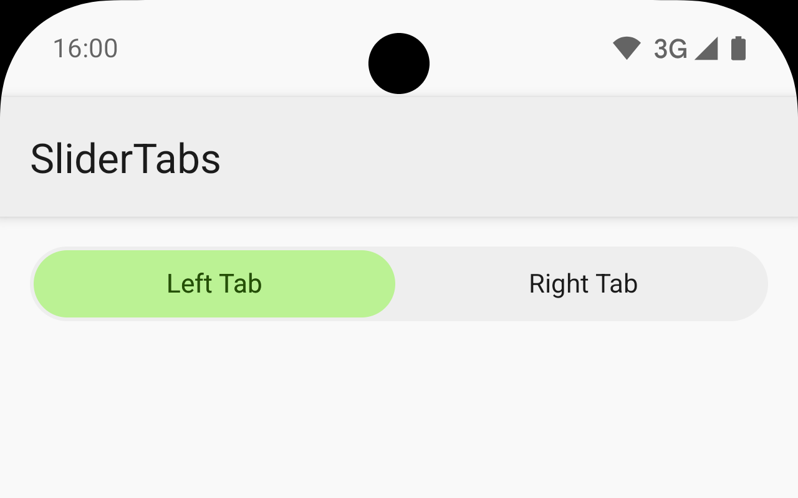
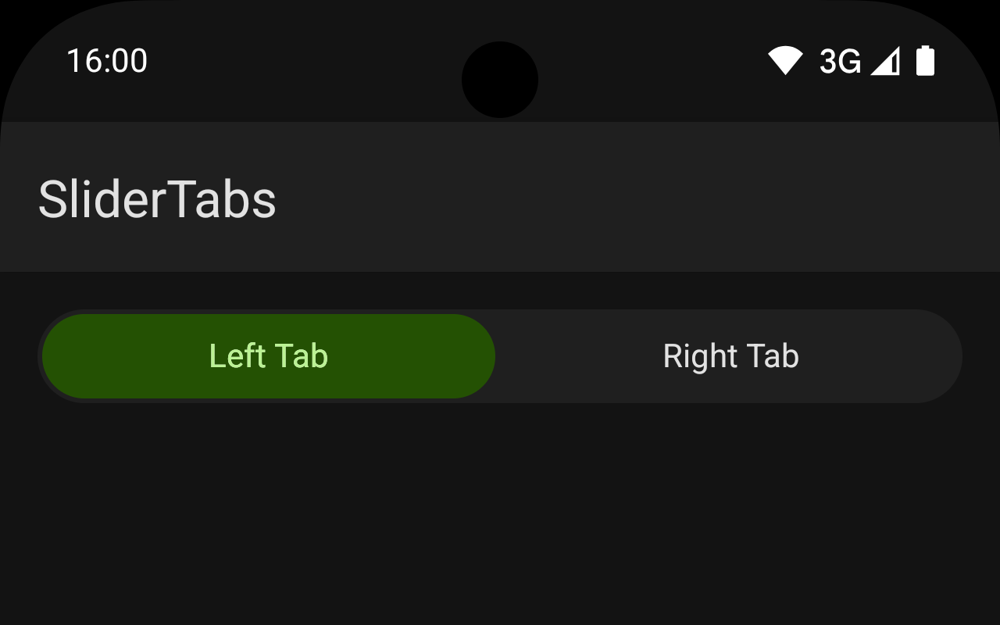

# SliderTabs

SliderTabs is a customizable two-state tab widget for Android, allowing users to toggle between two options with a smooth sliding indicator.
It supports [Android Dynamic Colors](https://developer.android.com/develop/ui/views/theming/dynamic-colors) for adaptive theming and provides a seamless user experience with state persistence across configuration changes.




## Table of Contents
- [Features](#features)
- [Installation](#installation)
- [Usage](#usage)
- [Customization](#customization)
- [Listening to Tab Selection Events](#listening-to-tab-selection-events)
- [State Persistence](#state-persistence)
- [License](#license)
- [Support](#support)

## Features
- **Two-State Toggle**: Switch between two tabs with a smooth sliding animation.
- **Dynamic Colors**: Adapts to the user's system theme (light/dark mode) using Android Dynamic Colors.
- **Customizable**: Configure colors, text, and animation duration via XML attributes.
- **State Persistence**: Retains selected tab state during configuration changes (e.g., screen rotation).
- **Event Listener**: Supports callbacks for tab selection events.

## Installation

### Prerequisites
- Android SDK with a minimum API level of 24 (Android 7.0 Nougat).
- Gradle build system.
- Kotlin for development.

### Steps
1. Add the SliderTabs repository to your `settings.gradle.kts` (or `settings.gradle` for Groovy):

 ```kotlin
 dependencyResolutionManagement {
     repositoriesMode.set(RepositoriesMode.FAIL_ON_PROJECT_REPOS)
     repositories {
         maven {
             name = "repository"
             url = uri("https://maven.vsulimov.com/releases")
         }
     }
 }
 ```

2. Include the SliderTabs dependency in your `build.gradle.kts` (or `build.gradle` for Groovy):

 ```kotlin
 dependencies {
     implementation("com.vsulimov:slidertabs:1.0.3")
 }
 ```

3. Sync your project with Gradle to download the library.

### Platform Notes
- Ensure your project uses AndroidX libraries for compatibility.
- For Groovy-based projects, replace `.kts` with `.gradle` and use Groovy syntax.

## Usage

### Adding SliderTabs to Your Layout
Add the `SliderTabs` view to your XML layout file:

```xml
<com.vsulimov.slidertabs.SliderTabs
    android:id="@+id/slider_tabs"
    android:layout_width="match_parent"
    android:layout_height="40dp"
    style="@style/SliderTabs"
    app:st_leftTabText="Tab 1"
    app:st_rightTabText="Tab 2" />
```

### Programmatic Usage
You can configure SliderTabs programmatically in your Activity or Fragment:

```kotlin
val sliderTabs = findViewById<SliderTabs>(R.id.slider_tabs)
sliderTabs.setLeftTabText("Option A")
sliderTabs.setRightTabText("Option B")
```

## Customization

Customize the appearance and behavior of SliderTabs using XML attributes:

| Attribute                   | Description                                      | Format         | Default         |
|----------------------------|--------------------------------------------------|----------------|-----------------|
| `st_backgroundColor`       | Background color of the view                    | Color          | Theme-dependent |
| `st_backgroundColorPressed`| Background color when pressed                   | Color          | Theme-dependent |
| `st_sliderColor`           | Color of the sliding indicator                  | Color          | Theme-dependent |
| `st_onTabTextColor`        | Color of the selected tab text                  | Color          | Theme-dependent |
| `st_onSurfaceTextColor`    | Color of the unselected tab text                | Color          | Theme-dependent |
| `st_leftTabText`           | Text for the left tab                           | String         | Left Tab        |
| `st_rightTabText`          | Text for the right tab                          | String         | Right Tab       |
| `st_animationDuration`     | Duration of the slider animation (milliseconds)  | Integer        | 300             |

Example customization in XML:

```xml
<com.vsulimov.slidertabs.SliderTabs
    android:layout_width="match_parent"
    android:layout_height="40dp"
    app:st_backgroundColor="#FFFFFF"
    app:st_sliderColor="#6200EE"
    app:st_leftTabText="On"
    app:st_rightTabText="Off"
    app:st_animationDuration="500" />
```

## Listening to Tab Selection Events

To handle tab selection events, set an `OnTabSelectedListener` on the `SliderTabs` view:

```kotlin
val sliderTabs = findViewById<SliderTabs>(R.id.slider_tabs)
sliderTabs.setOnTabSelectedListener(object : SliderTabs.OnTabSelectedListener {
    override fun onLeftTabSelected() {
        Toast.makeText(context, "Left tab selected", Toast.LENGTH_SHORT).show()
    }

    override fun onRightTabSelected() {
        Toast.makeText(context, "Right tab selected", Toast.LENGTH_SHORT).show()
    }
})
```

## State Persistence

SliderTabs automatically saves and restores its selected tab state during configuration changes (e.g., screen rotations), ensuring a consistent user experience without additional code.

## License

SliderTabs is licensed under the MIT License. See the [LICENSE](LICENSE) file for details.

## Support

For issues, feature requests, or questions, please:
- Contact the developer at [v.sulimov.dev@imap.cc](mailto:v.sulimov.dev@imap.cc).

## Troubleshooting

- **Dependency Sync Issues**: Ensure your internet connection is stable and the repository URL is correct.
- **Theme Conflicts**: Verify that your app uses AndroidX and Material Components for proper Dynamic Color support.
- **Animation Lag**: Reduce `st_animationDuration` for smoother performance on low-end devices.
